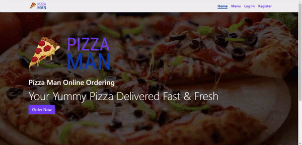

# Pizza Man Project

Architecting An E-Commerce website for ordering Pizza Online on AWS.

## Demo

    

## Demo Video
[Demo Video](https://drive.google.com/file/d/1D4QarNLOjilppqF8cS8mUhvze1rLG7aZ/view?usp=sharing)

**NOTE:** The features shown in the demo is not exhaustive. Only the core features are showcased in the demo.

## Tools used

1. React: To create the Single Page App
2. React-Router: For Routing
3. Redux: For State Management
4. AWS

## Tech Stack

- Web Technologies: HTML, CSS, JavaScript
- Framework: React.js
- Cloud Services: AWS (Lambda, S3, DynamoDB, Cognito, CodeCommit, CodeBuild, CodePipeline, Route53, CloudFront, VPC, ALB, WAF, ACM, CloudFormation)

## Architecture Diagram

Architecture Diagram

Category of Services Used

Adherence to AWS Well-Architected Framework

## How to Use

To use the project follow the steps given below:

1. Install the necessary modules (`npm install`).
2. Setup Firebase Project and configuration
3. Use `npm start` to run the react app
